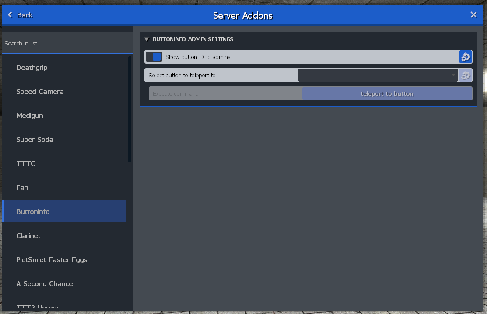

# TTT2 Button Info
 
TTT2 Button Info is an addon that brings more info about the button you're looking at. TTT2 has targetID (info on what you're looking at) for many entities on the map. One of these entities are buttons and levers. Because TTT never intended on info about them being shown to the user, the entities lack any data for diplay. The solution of this addon is to provide a curated list with information on map buttons. Currently the following maps are supported:

- [arcane_mine](https://steamcommunity.com/sharedfiles/filedetails/?id=1463001141)
- [ttt_clue_2018_b7](https://steamcommunity.com/sharedfiles/filedetails/?id=1490186898)
- [ttt_clue_se](https://steamcommunity.com/sharedfiles/filedetails/?id=281454209)
- [ttt_elevatorandstairs](https://steamcommunity.com/sharedfiles/filedetails/?id=255086323)
- [ttt_lego](https://steamcommunity.com/sharedfiles/filedetails/?id=295897079)
- [ttt_mc_jondome](https://steamcommunity.com/sharedfiles/filedetails/?id=322655757)
- [ttt_minecraft_b5](https://steamcommunity.com/sharedfiles/filedetails/?id=159321088)
- [ttt_minecraft_b7_summer](https://steamcommunity.com/sharedfiles/filedetails/?id=2572798746)

## How to Contribute

This project is community driven. While I will probably add more maps overt time, there are A LOT of maps. So it would be really nice if you could help with it!

### Clone the Project

The first step works like any other addon: Fork and clone the repository on your local machine and put it in your addons folder. See our [development guide](https://docs.ttt2.neoxult.de/developers/basics/creating-an-addon/) for more info.

### Loading the Map

Load the map that you want to add support for. In the admin menu you can find under `Server Addons` a submenu called `Buttoninfo`. In there you should enable the setting that lets you see the button-ID. Below that is a action button. You can select a button and teleport to it, this should simplify the process of finding all buttons.



### Adding Information

It is probably best to check out how the other buttons are made, but here's a quick list of what you should do:

1. create a folder with the exact(!) map name localed in `lua/terrortown/buttoninfo/`
2. create a file for each button, the file name doesn't matter, but I tend to use `button<buttonID>` to make things more clear
3. add localization to the language file

### Open a Pull-Request

When you're done, you push your changes to your fork and open a pullrequest to this addon. Then we can update it on steam and the supported library grows.

## Button API

Here's a list of all elements a button can have:

```lua
-- This one is required. It is used to assign the lua file to the button in-game.
-- The button ID can be found when looking at button while the admin mode is enabled.
BUTTONINFO.buttonID = 1

-- The game detects if it is a button or lever. But on some maps this is false due
-- to false flags being set by the map dev. You can overwrite this here. Overwriting
-- it will update the title and subtitle.
-- Valid values: BUTTON_TYPE_BUTTON, BUTTON_TYPE_LEVER
BUTTONINFO.buttonType = <overwrite>

-- The title of the button. If it is not set, the default will be used.
BUTTONINFO.title = "buttoninfo_<your_title>"

-- A description line. Most of the time you want to set this as it describes what the
-- button does. If it is not set, nothing will be added.
BUTTONINFO.description = "buttoninfo_<your_description>"

-- You can completely hide a button from targetID by settings this to true. Be aware
-- that is always hidden then, even if you set a title, description or whatever.
BUTTONINFO.hidden = <value>

-- Here you can define the states where the targetID will be hidden. Some buttons can
-- be triggered only once and change their state after trigger. That way you can hide
-- targetID to prevent your users from being confused. You see the state in targetID
-- when the admin mode is enabled.
BUTTONINFO.hideForState = {
    [0] = true,
}

-- Similar to the hideForState variable, this can set a specific description for a
-- given button state. This adds an additional description line if you already added
-- one.
BUTTONINFO.descriptionForState = {
    [1] = "buttoninfo_<your_specific_description>",
}
```
